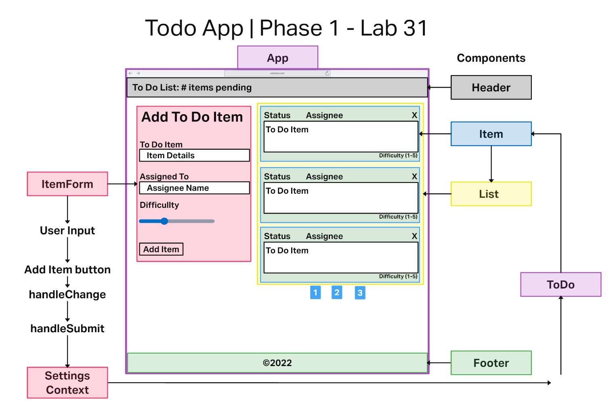
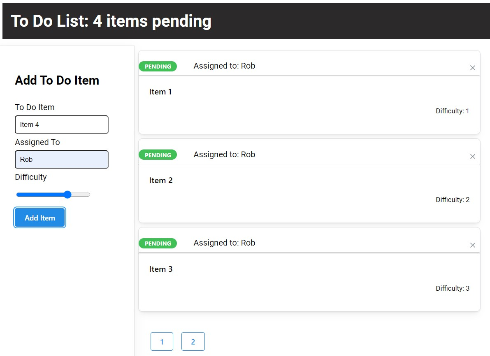
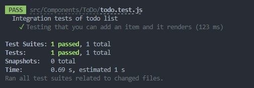

# Todo App

## Code 401d48 lab 31-34

## Author: Robert Ball

### built upon the starter code located [Seattle Code Javascript-401d48](https://github.com/codefellows/seattle-code-javascript-401d48/tree/main/class-31/lab/starter-code)

---

### Phase 1 live on [codesandbox.io](https://codesandbox.io/p/github/RDBALL/todo-app/lab31?file=%2FREADME.md&workspace=%257B%2522activeFileId%2522%253A%2522cl9xp80ye0014lrgybp0p1vm8%2522%252C%2522openFiles%2522%253A%255B%255D%252C%2522sidebarPanel%2522%253A%2522EXPLORER%2522%252C%2522gitSidebarPanel%2522%253A%2522COMMIT%2522%252C%2522sidekickItems%2522%253A%255B%257B%2522type%2522%253A%2522TERMINAL%2522%252C%2522shellId%2522%253A%2522cl9xp9l380006lpgy1di2g5ac%2522%252C%2522key%2522%253A%2522cl9xp9k9l00cb356hxjmotavn%2522%252C%2522isMinimized%2522%253Afalse%257D%252C%257B%2522key%2522%253A%2522cl9xp972z0097356h1rddal07%2522%252C%2522type%2522%253A%2522PROJECT_SETUP%2522%252C%2522isMinimized%2522%253Afalse%257D%255D%257D)

---
Documentation:



---

## Problem Domain

* A Web Application for securely managing a To Do List

---

## Phase 1 - Requirements

* In Phase 1, we're going to perform some refactoring of the To Do application as built by another team. This application mixes application state and user settings at the top level and passes things around. It was a good proof of concept, but we need to make this production ready.

---
Requirements:

* Style the application using the [Mantine  Component API](https://mantine.dev/pages/getting*started/)

* Properly modularize the application into separate components

* Implement the Context API to make some basic application settings available to components
  * How many To Do Items to show at once
  * Hide completed items

### Rendering Phase 1 app results



---

### Testing

* Testing was done using the the `@testing-library/react` and `@testing-library/jest-dom/extend-expect` testing libraries.



### *Known Bug: The app will crash if the user does not input an item and an assigned individual*

* Working on tracking down and fixing

---

### Dependencies

```JSON
{
    "@emotion/react": "^11.10.5",
    "@mantine/core": "^5.6.3",
    "@mantine/form": "^5.6.3",
    "@mantine/hooks": "^5.6.3",
    "@testing-library/jest-dom": "^5.16.5",
    "@testing-library/react": "^13.3.0",
    "@testing-library/user-event": "^13.5.0",
    "react": "^18.2.0",
    "react-dom": "^18.2.0",
    "react-scripts": "5.0.1",
    "uuid": "^8.3.2",
    "web-vitals": "^2.1.4"
}
```
---

### Setup

* npx create-react-app on your local machine
* delete the src folder and the package.json file from your local machine.
* copy the src and package.json from this repo into your local React app
* install required dependencies with npm i

---

Previous UMLs
