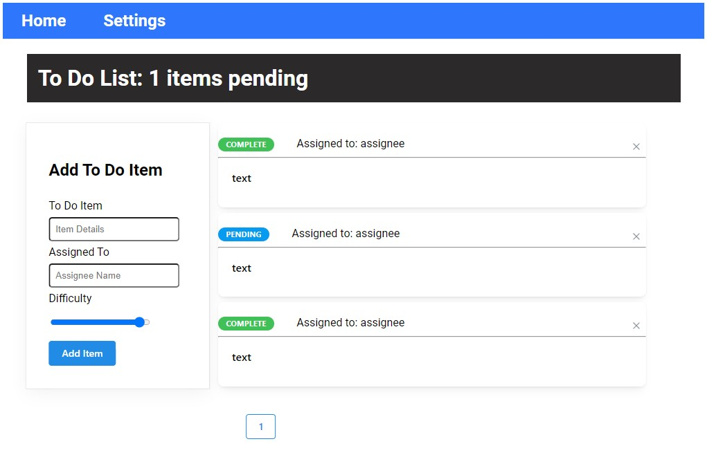

# Todo App

## Code 401d48 lab 31-34

## Author: Robert Ball

### built upon the starter code located [Seattle Code Javascript-401d48](https://github.com/codefellows/seattle-code-javascript-401d48/tree/main/class-31/lab/starter-code)

---

### Phase 4 live on [Netlify](https://stellar-cucurucho-483f62.netlify.app/)

### Phase 1 live on [codesandbox.io](https://codesandbox.io/p/github/RDBALL/todo-app/lab31?file=%2FREADME.md&workspace=%257B%2522activeFileId%2522%253A%2522cl9xp80ye0014lrgybp0p1vm8%2522%252C%2522openFiles%2522%253A%255B%255D%252C%2522sidebarPanel%2522%253A%2522EXPLORER%2522%252C%2522gitSidebarPanel%2522%253A%2522COMMIT%2522%252C%2522sidekickItems%2522%253A%255B%257B%2522type%2522%253A%2522TERMINAL%2522%252C%2522shellId%2522%253A%2522cl9xp9l380006lpgy1di2g5ac%2522%252C%2522key%2522%253A%2522cl9xp9k9l00cb356hxjmotavn%2522%252C%2522isMinimized%2522%253Afalse%257D%252C%257B%2522key%2522%253A%2522cl9xp972z0097356h1rddal07%2522%252C%2522type%2522%253A%2522PROJECT_SETUP%2522%252C%2522isMinimized%2522%253Afalse%257D%255D%257D)

---
Documentation:


---

## Problem Domain

* A Web Application for securely managing a To Do List

---

## Phase 4 - Requirements

* In Phase 4, we will finalize the functionality of the application by connecting to live servers for login, authorization, and data access

---
Requirements:

* Alter the Add, Toggle Complete, and Delete functions within your to do application to use your API instead of in memory state.
  * Fetch the current list of items from the database on application start
  * Whenever you add/update/delete an item, refresh the state so the user can instantly see the change
    * Consider: Do you re-fetch from the server every time you make a change?
      * If so, how?
      * If not, how will you stay in sync?
* Alter the Login Context to use the server to login users instead of our mock users list.
  * Be sure to store the token in state as well as in a cookie so you can reference it later.

### Rendering Phase 4 app results


---

## Phase 3 - Requirements

* In Phase 3, we’d like to extend the functionality of the application by requiring users be logged in to view items and also restrict access based on user type. The user stories from Phases 1, and 2 remain unchanged. For this phase, we are now adding the following new user stories.

---
Requirements:

* As a user, I want to provide a way for other users to create new accounts
* As a user, I want to provide a way for all users to login to their account
* As a user, I want to make sure that my To Do items are only viewable to users that have logged in with a valid account.
* As a user, I want to ensure that only fellow users that are allowed to “create”, based on their user type, can add new To Do Items
* As a user, I want to ensure that only fellow users that are allowed to “update”, based on their user type, can mark To Do Items complete
* As a user, I want to ensure that only fellow users that are allowed to “delete”, based on their user type, can delete new To Do Items

### Rendering Phase 3 app results


---

### API

Enabled Logins:

```JSON
  {
    "Admin": {
    "password": "admin",
    },
    "Reader": {
      "password": "reader",
    "capabilities": ['read'],
    },
    "Writer": {
      "password": "writer",
    "capabilities": ['read', 'write'],
    },
    "Editor": {
      "password": "editor",
    "capabilities": ['read', 'write', 'update', 'delete'],
    },
  }
```

---

## Phase 2 - Requirements

* In Phase 2, we’re going to extend the functionality of our application by allowing the user to make some decisions on how they would like the application to function. Specifically, we’ll let them make changes to 2 settings.

---
Requirements:

* Implement the Context API to make some basic application settings available to components
  * How many To Do Items to show at once
  * Whether or not to show completed items
* Provide the users with a form where they can change the values for those settings
  * This should be given in the form of a new component, perhaps linked to from the main navigation
  * Hint: Use Browser Router to create the page/route/component for this
  * Once settings are updated, render the updated settings to the right of the “form”. Consider using Grid, Card, and When components.
* Save the user preferences in Local Storage
* Retrieve their preferences from Local Storage and apply them to the application on startup

### Rendering Phase 2 app results



---

### Testing Phase 2

* Testing was done using the the `@testing-library/react` and `@testing-library/jest-dom/extend-expect` testing libraries.


---

## Phase 1 - Requirements

* In Phase 1, we're going to perform some refactoring of the To Do application as built by another team. This application mixes application state and user settings at the top level and passes things around. It was a good proof of concept, but we need to make this production ready.

---
Requirements:

* Style the application using the [Mantine  Component API](https://mantine.dev/pages/getting*started/)

* Properly modularize the application into separate components

* Implement the Context API to make some basic application settings available to components
  * How many To Do Items to show at once
  * Hide completed items

### Rendering Phase 1 app results


---

### Testing Phase 1

* Testing was done using the the `@testing-library/react` and `@testing-library/jest-dom/extend-expect` testing libraries.


---

### Dependencies

```JSON
{
  "@emotion/react": "^11.10.5",
    "@mantine/core": "^5.6.3",
    "@mantine/form": "^5.6.3",
    "@mantine/hooks": "^5.6.3",
    "@testing-library/jest-dom": "^5.16.5",
    "@testing-library/react": "^13.3.0",
    "@testing-library/user-event": "^13.5.0",
    "react": "^18.2.0",
    "react-dom": "^18.2.0",
    "react-scripts": "5.0.1",
    "uuid": "^8.3.2",
    "web-vitals": "^2.1.4"
}
```

---

### Setup

* npx create-react-app on your local machine
* delete the src folder and the package.json file from your local machine.
* copy the src and package.json from this repo into your local React app
* install required dependencies with npm i

---

Previous UMLs


